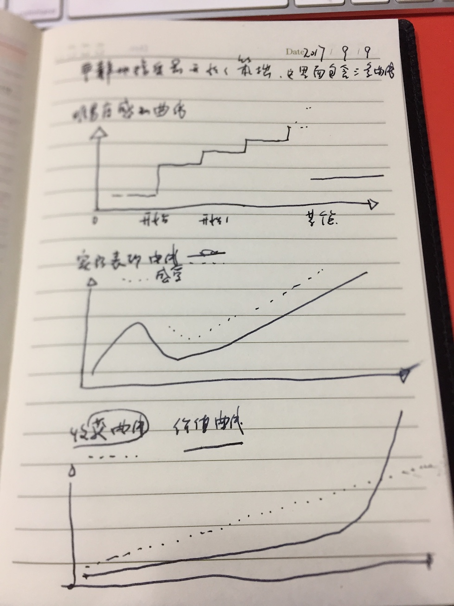

今天给自己选项目添加了三个条件：

5分制

| 项目   | 落地性  | 赚钱吗  | 成长性  |
| ---- | ---- | ---- | ---- |
|      |      |      |      |
|      |      |      |      |
|      |      |      |      |

注意：打的分，是真相吗？代表真相吗？

特别注意：现阶段，2017年，落地性，对我来说，几乎就是一切。因为，我欠缺最大的就是，行动中的思考。这个原因主要是，在过去的18年里，从1999年开始，缺乏的能力是——**平静的接受自己最开始的笨拙**。难易度感受曲线：可能是这样的：实际表现曲线是这样的：而收货曲线又是这样的，最终形成**价值曲线**。

> 1999年代暑假，你并没有兑现买摩托车的承诺。
>
> 2014年，30岁生日，我并没有实现买车的愿望。

难易度感受曲线：入门容易，猛然遇到困难，进一步难，然后难一段时间，然后才能继续行进。

实际表现曲线：从高到低，到低迷，然后才能往上走。

收获曲线: 这是一条相对更稳定的曲线缓慢上升的曲线。

价值曲线：这是一个复利曲线。

说到底，平静的接受自己最开始时候的笨拙，这是我开始一切事情的最大的挑战。

说一件高兴的事儿，在过去的21天里， 我完成了js的入门，在41个时间段花费了50h以上最精纯的时间。帮助同学的时间不算在内，大约在20小时左右。我几乎完成了整个的自信的it心里重建。感谢。 **2017-9-9**

2017-10-19

用排除法，选一个方向，用100天，做到极致，去挖掘赚钱的方向。这个思路是**集中精力打歼灭仗。** 因为要面对严酷的竞争，赚钱的竞争，能活下来，就不错。挑一个最可能存活的领域。看看我要去满足人们的什么需求。 

断其十指，不如伤其一指。**(赚钱)** 这意味着，越细越好

包括 做投资。高领。

如果是钢琴，那么就在钢琴领域，如果是书法，那么就在书法领域，如果是app，那么就是在app领域，切记，切记。

花完拉倒。我不可能同时做好多个项目，我不可能同时做好多个项目，然后还能赢。没有人可以做到。

我有那么多兴趣，那么选一样就好了。而且是必须选的，选定了，那么就干吧。10天时间到这个月底吧，仔细想想。到29号。

估计一个预算。

---

写文章，乱写一汽，到处投稿，靠稿费为生。**写教程/分析报告**

编代码，精品app 做一个上榜的app，靠it外包为生。

> 设计家。统计频次
>
> 程序员，再教育。

做一个之前没有做过的,

js开发

去上班，做销售为生，家明外包公司的销售。

去上班，小米的线下店，渠道，**新零售。**

创业，选一个赛道。去做demo，建团队，拉风投。（面向某个平台）

设计，让生活变得更美好！  

钢琴社群。

书法社群。

Better Wolrd, Better Life.